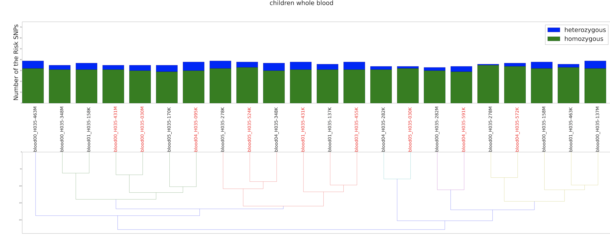

# Genome Wide Identification of meQTLs in Whole Blood for Obesity 

DNA methylation quantitative trait loci (meQTLs) means genetic variants or Single-nucleotide polymorphism(SNP) are associated with differnt site-specific CpGs methylation pattern. By knowing the meQTLs variants and SNPs associated with obesity, we can obtain the causal methylation site for obeisty via two-sample Mendelian Randomisation.

## **Materials**
- Case contrl study: 7 whole blood sample in obese group; 
                   7 whole bllod sample in normal group
- SNPs calling  for each sample                    
- DNA methylation profiling for each sample
- meQTLs mapping by means of ANOVA and linear regression

## **Analysis Workflow**
### 1. **SNP genotyping association with clinical traits**

### 2. **Clustering the SNPs genotype pattern and count the heterozygous and homozygous SNPs** 

### 3. **Identification of causal CpGs for obesity via Two sample Mendelian Randomisation (2SMR)**

## **Input Files** 
### SNPs profiling for all samples 
| blood05_H035-030K | blood05_H035-031K   | blood05_H035-032K |   id       |
| :----------------:|:-------------------:|:-----------------:|:----------:|
| 3:0               | 3:0                 | 3:0               | rs17541203 |

### Clinical traits for all samples 
|SAMPLE            |GROUP          | 
| -----------------|:-------------:| 
| blood05_H035-030K| obese         | 
| blood05_H035-031K| normal        | 

### SNPs genotype mapping 
| 1       | AA           | 
| --------|:------------:| 
| 2       | CC           | 
| 3       | GG           |
| ...     | ...          |

### meQTLs 
(cis-meQTLs by ANOVA; cis-meQTLs by LR; tran-meQTLs by ANOVA; tran-meQTLs by LR)

| SNP                | SNP_CHROM| SNP_POS|GENE                 | GENE_START| GENE_END| T_STAT  | P_VALUE | FDR      |
|:------------------:|:--------:|:------:|:-------------------:|:---------:|:-------:|:-------:|:-------:|:---------:|
| 9_10177_rs10968576 | 9        |10177   | 11_25607915_25607917| 1001667   | 1001669 | 2.518992| 0.014499| 0.786965 |

### GWAS SNPs Summary data obtain from [GWAS Catalog](https://www.genome.gov/genetics-glossary/Genome-Wide-Association-Studies)) 

## Analysis Steps

### **1. Data Prepation** [df.py](https://github.com/leungman426/Genome-wide-identification-of-meQTLs/blob/master/df.py)

Output Files: 
- Count the heterzgyous and homozgyous SNPs

| samples          | heterozygou| homozygous |total| 
|------------------|:----------:|:----------:|:---:|
| blood05_H035-030K| 15         | 12         |27   |

- Count the case and control samples for each SNP genotypes 

| snp       | genotype| count_homo |count_heter1| count_heter2|
| :--------:|:-------:|:----------:|:----------:|:-----------:| 
| rs10968576| G       | 15         |1           |1            |

- Simplified SNPs profiling 

| blood05_H035-030K | blood05_H035-031K   | blood05_H035-032K |   id       |
| :----------------:|:-------------------:|:-----------------:|:----------:|
| 3                 | 3                   | 3                 | rs17541203 |

### **2. SNP genotyping association with clinical traits** [stat_test.R](https://github.com/leungman426/Genome-wide-identification-of-meQTLs/blob/master/stat_test.R)

Outputs:
- Fisher's exact test 

| snp      |p_value        | 
| ---------|:-------------:| 
|rs10968576| 0.246         | 

- SNPs' genotyptes significantly different between cases and controls 

| snp      |case    | control|
| ---------|:------:|:------:| 
|rs10968576| GG     | GA     |

### **3. Clustering the SNPs genotype pattern and count the heterozygous and homozygous SNPs**
Use the stacked bar plot with dendrogram: [stacked barplot with dendrogram](https://github.com/leungman426/Stacked-Barplot-with-Dendrogram)
Hierachical clustering of SNPs genotypes (dengrogram) 
+
countheterozygous and homozygous calling (bar plot)

### **4. Identification of causal CpGs for obesity via Two sample Mendelian Randomisation (2SMR)**
[MR analyse.R](https://github.com/leungman426/Genome-wide-identification-of-meQTLs/blob/master/MR%20analyses.R)

2SMRwas used to identify putatively causal CpGs for obestiy.
Instrumental variable(IV): cis-meQTL SNPs; trans-meQTLs SNPs (anaylsed by ANOVA or Linear Regression)
*cis: a SNP is within 1Mb upstream or downstream of a CpG site; trans: a SNP is >1Mb away from a CpG site

Exposure data -> association of SNPs with CpGs 

| SNP                | SNP_CHROM| SNP_POS|GENE                 | GENE_START| GENE_END| T_STAT  | P_VALUE | FDR      |
|:------------------:|:--------:|:------:|:-------------------:|:---------:|:-------:|:-------:|:-------:|:---------:|
| 9_10177_rs10968576 | 9        |10177   | 11_25607915_25607917| 1001667   | 1001669 | 2.518992| 0.014499| 0.786965 |

Outcome data -> association of SNPs with obestiy (from [GWAS Catalog](https://www.genome.gov/genetics-glossary/Genome-Wide-Association-Studies))

Required R package: [TwoSampleMR](https://github.com/MRCIEU/TwoSampleMR)

**steps:**
1. obtain **Exposure data** `read_exposure_data()`
2. obtain **Outcome data** `read_outcome_data()`
3. Harmonise data `harmonise_dataa()`
4. perfom MR `harmonise_data()`
5. scatter plot: plot the relationship of the SNP effects on the exposure against the SNP effects onthe coutcome

